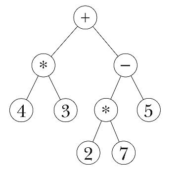

# Structure and Interpretation of Computer Programs
## 프로시저를 써서 요약하는 방법
계산프로세스, 컴퓨터속에 있는 data를 조작하면서 어떤 일을 하는 것
process는 사람이 만든 규칙에 따라 움직이고
이 규칙을 가르켜 program 이라고 함
program은 여러 식(symbolic expression)으로 되어있는데,
이런 식을 적을 때 쓰는 말을 program language 라고 함

[lisp](https://en.wikipedia.org/wiki/Lisp_(programming_language))을 통해 책의 내용을 전개해 나갈듯 함
사실은 lisp의 사투리인 [scheme](https://en.wikipedia.org/wiki/Scheme_(programming_language))으로 할거라고 함

### 프로그램 짤 때 바탕이 되는 것
* primitive expression, 기본식
* means of combination, 간단한 것을 모아 복잡한 것 compound element
* means of abstraction, 복잡한 것에 이름을 붙여서 간추림
#### 식
expression을 넣으면 evaluation 하여 값으로 변경
```scheme
123
;; 123
(+ 3 2)
;; 5
(* 2 3)
;; 6
(* (- 9 2) (+ 3 (/ 4 2)))
;; 35
```
#### 이름과 환경
변수만들기
```scheme
(define size 2)
(* 5 size)
;; 10
```
#### 엮은식combination을 계산하는 방법
나무꼴 그림

#### 묶음 프로시저compound procedure
```scheme
(define (squre x) (* x x))
;; 제곱을 만드는 squre 함수를 정의
```
#### 맞바꿈 계산법substitution model 으로 프로시저를 실행하는방법
여러 함수와 식이 중첩된 경우 밖에서부터 중첩된 함수를 풀어나감
#### 잊자 먼저 계산법applicative order과 정의대로 계산법normal order
* 정의대로 계산법
    * 값을 계산하지 않고, 제일 밑에 있는 식까지 전개했다가 한번에 계산하는 방법
#### 조건식과 술어predicate
```scheme
(define (abs x)
  (cond ((> x 0) x)
        ((= x 0) 0)
        ((< x 0) (-x)))

(define (abs2 x)
  (cond ((< x 0) (-x))
        (else x)))
```
